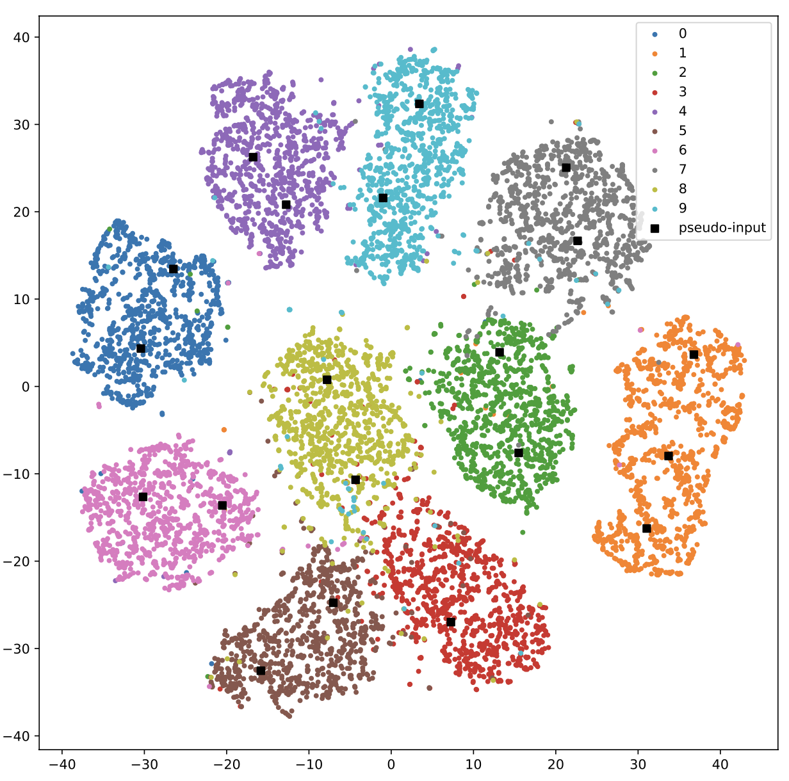

# Analyzing the Benefits of Prototypes for Semi-Supervised Category Learning

### Train VAE with VampPrior

**MNIST**

To train on MNIST using VAE with VampPrior,

`python code/experiment.py --model_name=pixelhvae_2level --dataset_name=static_mnist --number_components=500 --z1_size=40 --z2_size=40 --prior=vampprior --warmup=100 --lr=0.0005`

To train a standard VAE, replace the `--prior=vampprior` tag with `--prior=standard`.

`--number_components` refers to the number of pseudoinputs (this argument doesn't matter for standard VAE).

**CIFAR10**

For CIFAR10,

`python code/experiment.py --model_name=dcganvae --dataset_name=cifar10 --number_components=500 --z1_size=200 --prior=vampprior --warmup=0 --lr=0.0005`
To remove datapoints with high-entropy labels, add `--rm_labels=4` or `--rm_labels=2` to the end (to remove 4 or 2 labels).

### Analyze VAE

Two example trained models are included to reproduce some results of the paper. One can edit `main.py` to change the filepath for custom-trained models. To reproduce the paper on MNIST,

`python code/main.py --dataset=mnist`

On CIFAR10,

`python code/main.py --dataset=cifar10`

